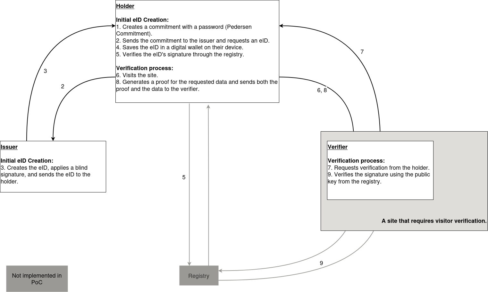

# BBS Rust Library PoC for Open Legal Lab 2024




## Overview

This repository hosts a Proof of Concept (PoC) developed during the Open Legal Lab 2024 Hackathon. This PoC was created by participants to better understand the practical aspects of the BBS library in a learning environment.

## Disclaimer

This code is a demonstration meant for learning and understanding the functionalities of the BBS library in Rust. It has not been designed with production-level security or efficiency considerations and thus should not be used in such environments.

## Prerequisites

- Rust Programming Language
- BBS Library for Rust
- SHA-256 Hashing (`sha2` crate)

## Installation

To get started with this PoC:

1. Install Rust on your system.
2. Clone the repository.
3. Navigate to the project directory.
4. Use Cargo to build and run the project:

```shell
cargo build
cargo run
```

## Project Structure

- `main.rs`: Contains the main logic showcasing key generation, message signing, and verification processes.
- `create_keys`: Generates a public and secret key pair for signing messages.
- `json_to_messages`: Transforms a JSON document into a vector of signature messages.
- `blind_sign_messages`: Produces a blind signature for a set of messages.
- `create_commitment`: Creates a cryptographic commitment using a blinding factor.
- `unblind_signature`: Converts a blind signature into a standard signature.
- `create_proof_request`: Sets up a proof request for a cryptographic proof.
- `create_proof_of_knowledge`: Creates a proof of knowledge for a subset of the signed messages.
- `check_signature_pok`: Checks the validity of a proof of knowledge.

## Features

The PoC demonstrates:
- Key generation compatible with the BBS signature scheme.
- Conversion of eID attributes into a format suitable for BBS signatures.
- Creation and handling of blind signatures and commitments.
- Generation and verification of proofs of knowledge to simulate the eID verification workflow.
